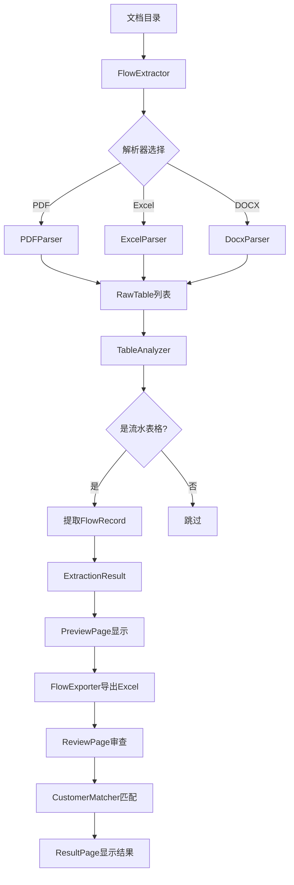

# Design Document: Bank Flow Audit System Refactor

## Overview

本设计文档描述银行流水审计系统重构的技术方案。重构主要解决以下问题：

1. **流水提取器逻辑错误**：`_process_document` 方法提前return导致后续代码不执行
2. **DOCX解析器缺失方法**：缺少 `extract_raw_tables` 方法
3. **预览页面功能不完整**：导出和审查功能未实现
4. **主窗口导航缺失**：`_switch_page` 和 `_show_settings` 方法未定义
5. **审查流程复杂**：需要简化为直接读取流水Excel

技术栈：Python 3.8 + PyQt5

## Architecture

系统采用分层架构，主要分为以下层次：

```
┌─────────────────────────────────────────────────────────────┐
│                        UI Layer                              │
│  ┌──────────┐ ┌──────────┐ ┌──────────┐ ┌──────────┐       │
│  │ExtractPage│ │PreviewPage│ │ReviewPage│ │ResultPage│       │
│  └─────┬────┘ └─────┬────┘ └─────┬────┘ └─────┬────┘       │
│        │            │            │            │              │
│        └────────────┴─────┬──────┴────────────┘              │
│                           │                                  │
│                    ┌──────┴──────┐                          │
│                    │ MainWindow  │                          │
│                    └──────┬──────┘                          │
└───────────────────────────┼─────────────────────────────────┘
                            │
┌───────────────────────────┼─────────────────────────────────┐
│                     Core Layer                               │
│  ┌──────────────┐  ┌──────────────┐  ┌──────────────┐       │
│  │FlowExtractor │  │FlowReviewer  │  │FlowExporter  │       │
│  └──────┬───────┘  └──────┬───────┘  └──────────────┘       │
│         │                 │                                  │
│  ┌──────┴───────┐  ┌──────┴───────┐                         │
│  │TableAnalyzer │  │CustomerMatcher│                         │
│  └──────────────┘  └──────────────┘                         │
└─────────────────────────────────────────────────────────────┘
                            │
┌───────────────────────────┼─────────────────────────────────┐
│                    Parser Layer                              │
│  ┌──────────┐  ┌──────────┐  ┌──────────┐                   │
│  │PDFParser │  │ExcelParser│  │DocxParser│                   │
│  └──────────┘  └──────────┘  └──────────┘                   │
└─────────────────────────────────────────────────────────────┘
```

### 数据流



## Components and Interfaces

### 1. FlowExtractor（流水提取器）

**文件**: `src/core/extractor.py`

**修复内容**: `_process_document` 方法逻辑错误

```python
def _process_document(
    self,
    doc_path: Path,
    task_id: str,
    batch_size: int
) -> tuple:
    """
    处理单个文档，提取流水记录
    
    修复：移除提前return，确保完整执行表格提取和AI分析流程
    
    Args:
        doc_path: 文档路径
        task_id: 任务ID
        batch_size: 批处理大小
        
    Returns:
        (records: List[FlowRecord], stats: Dict)
    """
    records = []
    stats = {'total_tables': 0, 'flow_tables': 0}
    
    # 获取解析器
    parser = self._get_parser_for_file(doc_path)
    if not parser:
        logger.warning("无解析器: %s", doc_path.name)
        return records, stats  # 仅在无解析器时返回
    
    # 继续执行表格提取（修复：移除错误的提前return）
    raw_tables = self._extract_raw_tables(doc_path, parser)
    stats['total_tables'] = len(raw_tables)
    
    # 处理每个表格...
    for table in raw_tables:
        # AI分析和流水提取逻辑
        pass
    
    return records, stats
```

**接口定义**:

```python
class FlowExtractor:
    def extract_flows(
        self,
        document_folder: str,
        task_id: Optional[str] = None,
        batch_size: int = 20
    ) -> ExtractionResult:
        """从文档目录提取所有流水"""
        pass
    
    def _process_document(
        self,
        doc_path: Path,
        task_id: str,
        batch_size: int
    ) -> Tuple[List[FlowRecord], Dict]:
        """处理单个文档"""
        pass
    
    def _extract_raw_tables(
        self,
        file_path: Path,
        parser: BaseParser
    ) -> List[RawTable]:
        """从文档提取原始表格"""
        pass
```

### 2. DocxParser（DOCX解析器）

**文件**: `src/parsers/docx_parser.py`

**新增方法**: `extract_raw_tables`

```python
class DocxParser(BaseParser):
    def extract_raw_tables(self, file_path: Path) -> List[RawTable]:
        """
        从DOCX文件提取原始表格数据
        
        Args:
            file_path: DOCX文件路径
            
        Returns:
            List[RawTable]: 原始表格列表
        """
        pass
    
    def _table_to_raw(
        self,
        table: Table,
        table_index: int
    ) -> Optional[RawTable]:
        """
        将docx表格转换为RawTable
        
        Args:
            table: python-docx Table对象
            table_index: 表格索引
            
        Returns:
            RawTable对象，空表格返回None
        """
        pass
```

### 3. PreviewPage（预览页面）

**文件**: `src/ui/pages/preview_page.py`

**新增方法**: `_export_excel`, `_on_start_audit`, `set_extraction_result`

```python
class PreviewPage(QWidget):
    # 信号定义
    start_audit = pyqtSignal()  # 开始审查信号
    audit_requested = pyqtSignal(str)  # 审查请求信号，携带流水Excel路径
    
    def set_extraction_result(self, result: ExtractionResult) -> None:
        """
        设置提取结果并更新UI
        
        Args:
            result: 流水提取结果
        """
        pass
    
    def _export_excel(self) -> Optional[str]:
        """
        导出流水到Excel
        
        Returns:
            导出文件路径，失败返回None
        """
        pass
    
    def _on_start_audit(self) -> None:
        """
        处理开始审查按钮点击
        1. 导出流水Excel
        2. 发出审查请求信号
        """
        pass
```

### 4. MainWindow（主窗口）

**文件**: `src/ui/main_window.py`

**新增方法**: `_switch_page`, `_show_settings`

```python
class MainWindow(QMainWindow):
    def _switch_page(self, page_index: int) -> None:
        """
        切换到指定页面
        
        Args:
            page_index: 页面索引
                0 - ExtractPage (流水提取)
                1 - PreviewPage (流水预览)
                2 - ReviewPage (审查配置)
                3 - ResultPage (结果展示)
        """
        pass
    
    def _show_settings(self) -> None:
        """显示设置对话框"""
        pass
    
    def _on_extraction_complete(self, result: ExtractionResult) -> None:
        """
        处理流水提取完成
        1. 切换到预览页面
        2. 传递提取结果
        """
        pass
    
    def _on_audit_requested(self, flow_excel_path: str) -> None:
        """
        处理审查请求
        1. 切换到审查页面
        2. 设置流水Excel路径
        """
        pass
```

### 5. FlowReviewer（流水审查器）- 新增

**文件**: `src/core/reviewer.py`

**职责**: 简化的审查流程，直接读取流水Excel进行匹配

```python
@dataclass
class ReviewResult:
    """审查结果"""
    review_id: str
    review_time: str
    flow_excel_path: str
    customer_excel_path: str
    total_flows: int
    total_customers: int
    matched_count: int
    matches: List[MatchRecord]

@dataclass
class MatchRecord:
    """匹配记录"""
    flow_row: int
    counterparty_name: str
    customer_name: str
    match_type: str  # 精确匹配/脱敏匹配
    confidence: int
    transaction_time: str
    amount: str

class FlowReviewer:
    """
    流水审查器
    直接读取流水Excel与客户名单进行匹配
    """
    
    def __init__(self, config=None):
        pass
    
    def review(
        self,
        flow_excel_path: str,
        customer_excel_path: str
    ) -> ReviewResult:
        """
        执行审查
        
        Args:
            flow_excel_path: 流水Excel文件路径
            customer_excel_path: 客户名单Excel路径
            
        Returns:
            ReviewResult: 审查结果
        """
        pass
    
    def _load_flows_from_excel(self, excel_path: str) -> List[Dict]:
        """从Excel加载流水数据"""
        pass
    
    def _match_flows(
        self,
        flows: List[Dict],
        customers: List[str]
    ) -> List[MatchRecord]:
        """匹配流水与客户"""
        pass
```

## Data Models

### ExtractionResult（提取结果）

```python
@dataclass
class ExtractionResult:
    task_id: str                    # 任务ID
    task_time: str                  # 提取时间
    document_folder: str            # 文档目录
    total_documents: int            # 总文档数
    processed_documents: int        # 已处理文档数
    total_tables: int               # 总表格数
    flow_tables: int                # 流水表格数
    total_records: int              # 总流水记录数
    flow_records: List[FlowRecord]  # 流水记录列表
```

### FlowRecord（流水记录）

```python
@dataclass
class FlowRecord:
    source_file: str           # 来源文件
    original_row: int          # 原始行号
    transaction_time: str      # 交易时间
    counterparty_name: str     # 交易对手名
    counterparty_account: str  # 交易对手账号
    amount: str                # 金额
    summary: str               # 摘要
    transaction_type: str      # 收支类型
```

### RawTable（原始表格）

```python
@dataclass
class RawTable:
    table_index: int              # 表格索引
    html_content: str             # HTML格式内容
    rows: List[List[str]]         # 行数据
```

### 页面索引常量

```python
class PageIndex:
    EXTRACT = 0   # 流水提取页
    PREVIEW = 1   # 流水预览页
    REVIEW = 2    # 审查配置页
    RESULT = 3    # 结果展示页
```


## Correctness Properties

*A property is a characteristic or behavior that should hold true across all valid executions of a system—essentially, a formal statement about what the system should do. Properties serve as the bridge between human-readable specifications and machine-verifiable correctness guarantees.*

### Property 1: 流水提取器完整执行流程

*For any* 有效的文档路径和对应的解析器，当 `_process_document` 被调用时，`_extract_raw_tables` 方法应该被调用，且返回的统计信息中 `total_tables` 应该等于提取到的原始表格数量。

**Validates: Requirements 1.1, 1.2**

### Property 2: 错误处理后继续处理

*For any* 包含多个文档的目录，如果其中一个文档处理失败抛出异常，`extract_flows` 方法应该继续处理剩余文档，且 `processed_documents` 应该等于成功处理的文档数量。

**Validates: Requirements 1.3**

### Property 3: 提取结果完整性

*For any* 文档目录和提取操作，返回的 `ExtractionResult.flow_records` 列表长度应该等于 `ExtractionResult.total_records`，且所有记录的 `source_file` 字段应该指向存在的文档。

**Validates: Requirements 1.4**

### Property 4: DOCX表格提取数量一致性

*For any* 包含N个非空表格的DOCX文件，`DocxParser.extract_raw_tables` 返回的 `RawTable` 列表长度应该等于N，且每个 `RawTable` 的 `table_index` 应该唯一。

**Validates: Requirements 2.2, 2.3**

### Property 5: 导出路径正确性

*For any* 非空的流水记录列表和任务ID，`FlowExporter.export` 返回的文件路径应该位于 `~/.check-yg/flows/` 目录下，且文件应该实际存在。

**Validates: Requirements 3.5**

### Property 6: 审查按钮触发导出和信号

*For any* 包含流水记录的 `PreviewPage`，当 `_on_start_audit` 被调用时，应该先调用 `_export_excel`，如果导出成功，应该发出 `audit_requested` 信号并携带正确的文件路径。

**Validates: Requirements 4.1, 4.2, 4.3**

### Property 7: 页面切换和状态同步

*For any* 有效的页面索引（0-3），当 `_switch_page` 被调用时，`page_stack.currentIndex()` 应该等于该索引，且对应的导航按钮应该处于选中状态（`isChecked() == True`），其他按钮应该未选中。

**Validates: Requirements 5.1, 5.2, 5.4**

### Property 8: 配置持久化

*For any* 配置键值对，当通过 `SettingsDialog` 保存后，重新加载配置文件应该能获取到相同的值。

**Validates: Requirements 6.3**

### Property 9: 审查流程读取Excel

*For any* 有效的流水Excel文件和客户名单Excel文件，`FlowReviewer.review` 应该从流水Excel的"交易对手名"列读取数据进行匹配，而不是重新解析原始文档。

**Validates: Requirements 7.1, 7.2, 7.3**

### Property 10: 数据传递完整性

*For any* 流水提取结果，从 `ExtractPage` 发出 `extraction_completed` 信号到 `PreviewPage` 显示数据，`flow_records` 的数量应该保持不变，且所有记录的字段值应该完全一致。

**Validates: Requirements 8.1, 8.2, 8.3, 8.4**

## Error Handling

### 1. 文档解析错误

- **场景**: 文档格式损坏或不支持
- **处理**: 记录错误日志，跳过该文档，继续处理下一个
- **用户反馈**: 在进度日志中显示失败信息

### 2. AI服务不可用

- **场景**: LLM API 连接失败或超时
- **处理**: 使用降级模式，跳过AI分析步骤
- **用户反馈**: 显示警告提示，建议检查配置

### 3. 导出失败

- **场景**: 磁盘空间不足或权限问题
- **处理**: 捕获异常，显示错误对话框
- **用户反馈**: 显示具体错误原因和建议操作

### 4. 客户名单加载失败

- **场景**: Excel格式错误或文件不存在
- **处理**: 显示错误提示，阻止开始审查
- **用户反馈**: 提示用户检查文件格式

### 5. 页面切换时数据丢失

- **场景**: 用户在未保存时切换页面
- **处理**: 自动保存当前状态到内存
- **用户反馈**: 无需额外提示，数据自动保留

## Testing Strategy

### 单元测试

使用 `pytest` 框架进行单元测试：

1. **FlowExtractor 测试**
   - 测试 `_process_document` 完整执行流程
   - 测试错误处理和继续处理逻辑
   - 测试结果完整性

2. **DocxParser 测试**
   - 测试 `extract_raw_tables` 方法存在性
   - 测试多表格文档解析
   - 测试空表格和合并单元格边缘情况

3. **PreviewPage 测试**
   - 测试导出功能
   - 测试审查按钮逻辑
   - 测试空数据处理

4. **MainWindow 测试**
   - 测试页面切换
   - 测试导航状态同步
   - 测试信号连接

### 属性测试

使用 `hypothesis` 库进行属性测试，每个属性测试运行至少100次迭代：

```python
from hypothesis import given, strategies as st

# Property 3: 提取结果完整性
@given(st.lists(st.builds(FlowRecord, ...)))
def test_extraction_result_completeness(records):
    """
    Feature: bank-flow-audit-refactor, Property 3: 提取结果完整性
    """
    result = ExtractionResult(
        task_id="test",
        flow_records=records,
        total_records=len(records),
        ...
    )
    assert len(result.flow_records) == result.total_records

# Property 7: 页面切换和状态同步
@given(st.integers(min_value=0, max_value=3))
def test_page_switch_state_sync(page_index):
    """
    Feature: bank-flow-audit-refactor, Property 7: 页面切换和状态同步
    """
    window = MainWindow()
    window._switch_page(page_index)
    assert window.page_stack.currentIndex() == page_index
    for i, btn in enumerate(window.nav_buttons):
        assert btn.isChecked() == (i == page_index)
```

### 集成测试

1. **端到端流程测试**
   - 从文档提取到Excel导出的完整流程
   - 从Excel导出到审查完成的完整流程

2. **UI交互测试**
   - 使用 `pytest-qt` 测试按钮点击和信号发射
   - 测试页面间数据传递

### 测试配置

```python
# pytest.ini
[pytest]
testpaths = tests
python_files = test_*.py
python_functions = test_*
addopts = -v --tb=short

# hypothesis settings
[hypothesis]
max_examples = 100
deadline = None
```
